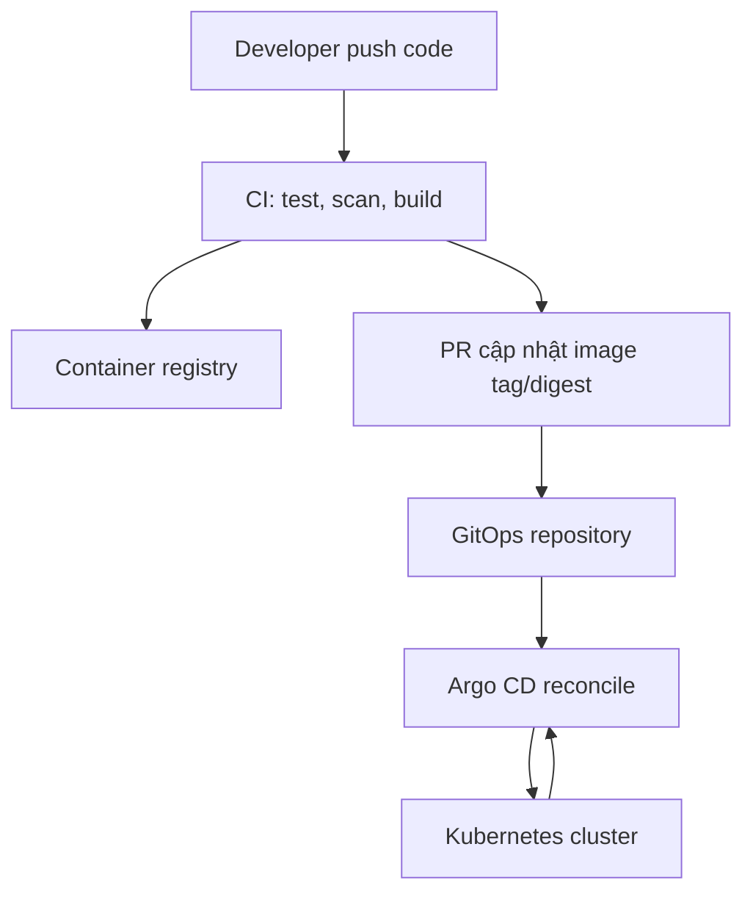

# Học Argo CD từ gốc đến production

Giáo trình thực hành bằng tiếng Việt dành cho người đã biết Kubernetes cơ bản và muốn hiểu Argo CD theo đúng tư duy GitOps — không chỉ biết bấm **SYNC**.

> Phiên bản lab: Argo CD `v3.4.2`. Môi trường chính: K3s; các manifest cũng chạy được trên kind, minikube hoặc Kubernetes chuẩn.

## Sau khóa này bạn làm được gì?

- Giải thích được GitOps, desired state, live state, drift và reconciliation.
- Hiểu Argo CD nằm ở đâu trong CI/CD và vì sao CI không nên giữ kubeconfig production.
- Cài Argo CD trên K3s, truy cập UI an toàn và kết nối Git repository.
- Tạo `Application` bằng UI lẫn YAML; hiểu từng trường thay vì chép mẫu.
- Đọc đúng hai trục `Sync Status` và `Health Status`.
- Biết chính xác **SYNC → SYNCHRONIZE** làm gì, khi nào nên bật `PRUNE`, `DRY RUN`, `APPLY ONLY`.
- Thực hành manual sync, auto-sync, prune, self-heal, rollback bằng Git và xử lý drift.
- Dùng Kustomize, Helm, AppProject, ApplicationSet, hooks và sync waves.
- Thiết kế luồng CI → container registry → GitOps repo → Argo CD → Kubernetes.
- Vận hành Argo CD với Ingress/TLS, RBAC, SSO, secrets, monitoring, backup và nâng cấp.
- Chẩn đoán các lỗi phổ biến như `ComparisonError`, `Degraded`, repo auth, project denied và sync treo.

## Mô hình phải nhớ



Argo CD không build image. Argo CD đọc trạng thái mong muốn từ Git, so sánh với cluster rồi — khi chính sách cho phép — đưa cluster về đúng trạng thái đó.

## Hai trạng thái không được nhầm

| Sync Status | Health Status | Cách đọc |
|---|---|---|
| `Synced` | `Healthy` | Cluster khớp Git và workload đang khỏe. |
| `OutOfSync` | `Healthy` | Workload vẫn chạy nhưng cấu hình trong cluster khác Git. |
| `Synced` | `Degraded` | Cluster đã nhận đúng manifest nhưng workload chạy lỗi. |
| `OutOfSync` | `Degraded` | Vừa lệch Git vừa có lỗi runtime. Xem diff và sự kiện Kubernetes. |
| `Unknown` | `Unknown` | Argo CD không đọc/render/đánh giá được; kiểm tra repo, cluster và controller. |

`Synced` không có nghĩa là ứng dụng chắc chắn hoạt động; `Healthy` cũng không có nghĩa cluster đang đúng Git.

## Lộ trình học

| Chương | Nội dung | Kết quả đầu ra |
|---|---|---|
| [01](docs/01-gitops-va-kien-truc.md) | GitOps và kiến trúc Argo CD | Vẽ và giải thích được vòng reconcile. |
| [02](docs/02-cai-dat-tren-k3s.md) | Cài trên K3s | Đăng nhập được UI và CLI. |
| [03](docs/03-application-dau-tien-bang-ui.md) | Application đầu tiên bằng UI | Tạo app, đọc cây resource và sync có chủ đích. |
| [04](docs/04-sync-health-drift.md) | Sync, health, prune, self-heal | Tạo drift và quan sát Argo CD sửa drift. |
| [05](docs/05-helm-kustomize.md) | Manifest, Kustomize và Helm | Chọn đúng cách render cho từng tình huống. |
| [06](docs/06-appproject-applicationset.md) | AppProject và ApplicationSet | Quản lý nhiều môi trường có giới hạn quyền. |
| [07](docs/07-hooks-waves-va-database.md) | Hooks, waves và migration | Điều phối migration an toàn hơn. |
| [08](docs/08-thiet-ke-ci-cd-gitops.md) | CI/CD hoàn chỉnh | Thiết kế promotion không build lại artifact. |
| [09](docs/09-ingress-tls-k3s.md) | Ingress/TLS với K3s Traefik | Truy cập Argo CD qua hostname và hiểu các lớp port. |
| [10](docs/10-production-security.md) | Production và bảo mật | Có checklist triển khai production. |
| [11](docs/11-troubleshooting.md) | Troubleshooting | Điều tra lỗi theo trình tự, không đoán mò. |
| [12](docs/12-cheatsheet-va-thuat-ngu.md) | Cheat sheet và thuật ngữ | Tra cứu nhanh khi vận hành. |

## Bắt đầu nhanh trong 15 phút

### 1. Kiểm tra cluster

```bash
kubectl config current-context
kubectl get nodes
```

Đừng bỏ qua bước này. Rất nhiều sự cố đến từ việc chạy lệnh trên nhầm cluster.

### 2. Cài Argo CD

```bash
kubectl create namespace argocd
kubectl apply -n argocd --server-side --force-conflicts \
  -f https://raw.githubusercontent.com/argoproj/argo-cd/v3.4.2/manifests/install.yaml

kubectl wait --for=condition=Available deployment --all \
  -n argocd --timeout=300s
kubectl get pods -n argocd
```

Manifest `install.yaml` là bản non-HA, phù hợp lab; không phải lựa chọn mặc định cho production.

### 3. Mở UI

```bash
kubectl port-forward svc/argocd-server -n argocd 8080:443
```

Mở `https://localhost:8080`. Lấy mật khẩu ban đầu ở terminal khác:

```bash
argocd admin initial-password -n argocd
```

Đăng nhập bằng user `admin`, đổi mật khẩu, rồi xóa secret ban đầu:

```bash
kubectl delete secret argocd-initial-admin-secret -n argocd
```

### 4. Tạo project và application

Các manifest trong bộ tài liệu đã trỏ tới repo:

```text
https://github.com/linhdo04/argocd-learning.git
```

Sau khi bạn chép bộ file này lên nhánh `main`:

```bash
kubectl apply -f labs/argocd/project.yaml
kubectl apply -f labs/argocd/application-manual.yaml
```

Mở UI. App `demo-manual` sẽ là `OutOfSync`, vì `Application` đã tồn tại nhưng workload trong `labs/base` chưa được apply. Đó là trạng thái mong đợi, không phải lỗi.

### 5. Sync có chủ đích

Trong UI:

1. Mở `demo-manual`.
2. Nhấn **SYNC** để mở bảng chọn cách đồng bộ.
3. Chưa bật **PRUNE** ở lần đầu.
4. Xem danh sách resource sẽ được tạo.
5. Nhấn **SYNCHRONIZE** để xác nhận thực thi.

`SYNC` mở màn hình chuẩn bị. `SYNCHRONIZE` mới thật sự yêu cầu Argo CD apply manifest vào cluster.

### 6. Kiểm tra kết quả

```bash
kubectl get all,configmap -n demo
kubectl port-forward svc/demo-web -n demo 8081:80
```

Mở `http://localhost:8081`. Trong UI, cây resource dự kiến gồm `Service`, `Deployment`, `ReplicaSet`, `Pod` và `ConfigMap`.

## Cấu trúc repository

```text
.
├── README.md
├── HUONG-DAN-CAP-NHAT.md          # Cách chép bộ tài liệu vào repo hiện có
├── docs/                       # Giáo trình theo chương
├── labs/
│   ├── base/                   # Workload dùng chung
│   ├── overlays/               # Kustomize dev/prod
│   ├── argocd/                 # AppProject/Application/ApplicationSet
│   ├── hooks/                  # PreSync/PostSync mẫu
│   └── ingress/                # Traefik IngressRoute mẫu
└── scripts/
    └── validate.sh             # Kiểm tra nhanh trước khi commit
```

## Nguyên tắc học hiệu quả

Mỗi lab đi theo vòng lặp:

1. **Dự đoán:** trước khi bấm, nói thành lời điều gì sẽ thay đổi.
2. **Thực hiện:** thao tác bằng UI hoặc commit Git.
3. **Quan sát:** xem diff, operation result, resource tree và Kubernetes events.
4. **Giải thích:** phân biệt lỗi render, lỗi apply và lỗi runtime.
5. **Khôi phục:** dùng Git revert hoặc sửa manifest, không chữa cháy bằng live edit rồi bỏ quên Git.

Nếu chỉ chạy lệnh mà không dự đoán trạng thái, bạn sẽ nhớ cú pháp nhưng chưa hiểu GitOps.

## Kiểm tra bộ lab

```bash
bash scripts/validate.sh
```

Script cần `kubectl`; nếu có `yamllint`, nó sẽ kiểm tra thêm style YAML.

Nếu bạn tải bản ZIP, xem [Hướng dẫn cập nhật repository](HUONG-DAN-CAP-NHAT.md) để chép file lên một branch mới và review diff trước khi merge.

## Lưu ý an toàn

- Không thực hành `prune` trên production.
- Không commit token, private key hoặc Kubernetes `Secret` plaintext/base64.
- Không dùng project `default` rộng mở cho team production.
- Không bật `allowEmpty: true` nếu chưa hiểu một source rỗng có thể dẫn tới xóa toàn bộ resource.
- Không để CI gọi `kubectl apply` và Argo CD cùng quản lý một resource.
- Luôn pin version trong automation; kiểm tra upgrade guide trước khi nâng minor version.

## Tài liệu chính thức

- [Argo CD documentation](https://argo-cd.readthedocs.io/en/stable/)
- [Getting Started](https://argo-cd.readthedocs.io/en/stable/getting_started/)
- [Application specification](https://argo-cd.readthedocs.io/en/stable/user-guide/application-specification/)
- [Automated Sync](https://argo-cd.readthedocs.io/en/stable/user-guide/auto_sync/)
- [Sync options](https://argo-cd.readthedocs.io/en/stable/user-guide/sync-options/)
- [Ingress](https://argo-cd.readthedocs.io/en/stable/operator-manual/ingress/)
- [Upgrade guides](https://argo-cd.readthedocs.io/en/stable/operator-manual/upgrading/overview/)

---

Bắt đầu từ [Chương 01 — GitOps và kiến trúc Argo CD](docs/01-gitops-va-kien-truc.md).
