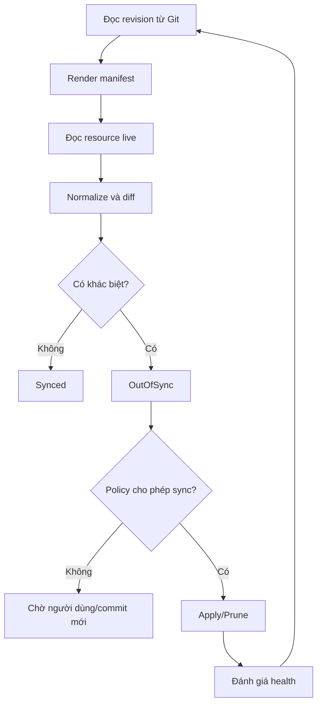
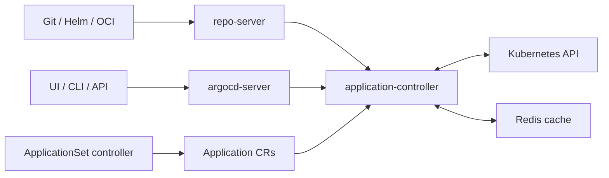

# 01 — GitOps và kiến trúc Argo CD

## Mục tiêu chương

Sau chương này, bạn có thể trả lời rõ ràng:

- Argo CD giải quyết vấn đề gì?
- GitOps khác một pipeline chạy `kubectl apply` thế nào?
- Thành phần nào render manifest, thành phần nào reconcile?
- Vì sao app có thể `Synced` nhưng vẫn `Degraded`?

## 1. Bài toán trước khi có GitOps

Một pipeline push-based thường làm như sau:

```text
CI -> đăng nhập cloud/cluster -> kubectl apply -> kết thúc
```

Cách này chạy được, nhưng phát sinh ba câu hỏi:

1. Ai phát hiện nếu sau deploy có người sửa trực tiếp trong cluster?
2. Trạng thái production chính xác nằm trong Git, trong pipeline hay trong cluster?
3. CI phải giữ credential mạnh đến mức nào để truy cập production?

GitOps biến Git thành nguồn mô tả trạng thái mong muốn. Một controller chạy gần cluster liên tục đối chiếu Git và trạng thái thật.

## 2. Bốn nguyên tắc thực dụng của GitOps

### Declarative

Ta khai báo kết quả cần có:

```yaml
spec:
  replicas: 3
```

Ta không viết chuỗi lệnh “tạo Pod A, B, C”. Controller chịu trách nhiệm hội tụ hệ thống về ba replica.

### Versioned and immutable history

Mỗi thay đổi đi qua commit/PR. Git cung cấp diff, lịch sử, review và revert. Git không tự làm hệ thống an toàn; branch protection và quyền merge vẫn phải được cấu hình.

### Pulled automatically

Controller trong cluster chủ động đọc nguồn cấu hình. CI không nhất thiết giữ kubeconfig production. Điều này giảm bề mặt credential nhưng không loại bỏ nhu cầu bảo vệ repository.

### Continuously reconciled

GitOps không kết thúc sau một lần deploy. Controller tiếp tục so sánh desired/live, phát hiện drift và có thể tự sửa theo policy.

## 3. Desired, rendered và live state

Ba lớp dễ bị gộp nhầm:

| Lớp | Ví dụ | Ai tạo/đọc? |
|---|---|---|
| Source | Helm chart, Kustomization, YAML trong Git | Git/repo-server |
| Rendered desired state | Deployment YAML hoàn chỉnh sau render | repo-server/controller |
| Live state | Deployment hiện có trong Kubernetes API | Kubernetes/controller |

Argo CD diff **rendered desired state** với **live state**. Vì vậy một chart Helm có thể không đổi nhưng `values` đổi vẫn làm app `OutOfSync`.

## 4. Vòng reconciliation



Webhook giúp Argo CD biết commit mới nhanh hơn; polling vẫn là cơ chế dự phòng. Webhook không phải thứ trực tiếp deploy.

## 5. Kiến trúc Argo CD



| Thành phần | Trách nhiệm chính | Khi lỗi bạn thường thấy gì? |
|---|---|---|
| `argocd-server` | UI, API, authentication, RBAC | Không đăng nhập/không mở UI/CLI lỗi kết nối |
| `argocd-repo-server` | Clone/cache repo, render Helm/Kustomize/plugin | `ComparisonError`, render fail, repo auth fail |
| `argocd-application-controller` | Diff, sync, health, theo dõi cluster | Reconcile chậm, app không cập nhật, operation treo |
| `argocd-applicationset-controller` | Sinh `Application` từ generator/template | AppSet không sinh app hoặc sinh sai hàng loạt |
| Redis | Cache trạng thái/tác vụ | Chậm, queue/cache lỗi; không phải source of truth bền vững |
| Dex | OIDC trung gian tùy cấu hình | SSO/login callback lỗi |
| Notifications controller | Gửi thông báo theo trigger/template | Không có Slack/email/webhook |

Argo CD lưu `Application`, `AppProject`, `ApplicationSet`, cấu hình và credential dưới dạng Kubernetes resources. Dữ liệu bền vững cuối cùng nằm trong etcd của cluster quản lý Argo CD; Redis chủ yếu là cache.

## 6. Ba CRD quan trọng

### Application

Trả lời bốn câu hỏi:

- Lấy cấu hình ở repository nào?
- Lấy revision nào?
- Render path/chart nào?
- Deploy vào cluster/namespace nào?

### AppProject

Là biên chính sách:

- repository nào được phép;
- cluster/namespace nào được phép;
- loại resource nào được hoặc không được phép;
- role nào được xem/sync app.

### ApplicationSet

Sinh nhiều `Application` từ dữ liệu: danh sách môi trường, folder trong Git, cluster đã đăng ký, pull request hoặc tổ hợp generator.

## 7. Argo CD làm gì và không làm gì

| Argo CD làm | Argo CD không làm thay |
|---|---|
| Render và apply Kubernetes manifest | Build/test source code |
| Theo dõi diff và health | Build/push container image |
| Audit revision đã sync | Secret vault/KMS |
| Điều phối hooks/waves | Thiết kế transaction database |
| Multi-cluster GitOps | Canary analysis đầy đủ như Argo Rollouts |

## 8. Câu hỏi tự kiểm tra

1. Nếu Deployment trong Git có `replicas: 3`, người vận hành scale live thành `5`, trạng thái sync là gì?
2. Nếu cluster đúng manifest nhưng Pod bị `CrashLoopBackOff`, sync và health là gì?
3. Component nào cần xem log khi Helm template render lỗi?
4. Vì sao cho CI quyền cluster-admin không phải điều kiện bắt buộc của GitOps?

Đáp án ngắn:

1. `OutOfSync`; nếu self-heal bật, Argo CD có thể đưa về `3`.
2. Thường `Synced` + `Degraded`.
3. `argocd-repo-server`.
4. CI chỉ cần cập nhật artifact và GitOps repo; controller trong cluster thực hiện deploy.

## Bài tập

Vẽ lại sơ đồ trên giấy cho hệ thống của bạn, ghi rõ:

- source-code repo;
- container registry;
- GitOps repo;
- Argo CD nằm ở cluster nào;
- ứng dụng chạy ở cluster/namespace nào;
- nơi giữ credential Git và cluster.

Tiếp theo: [02 — Cài Argo CD trên K3s](02-cai-dat-tren-k3s.md).
