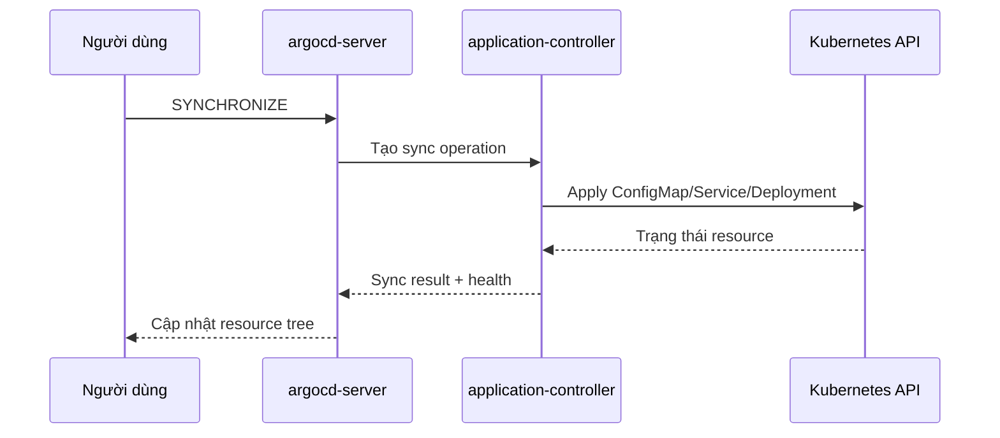

# 03 — Application đầu tiên bằng UI

Mục tiêu không phải “bấm cho chạy”, mà là hiểu Application ánh xạ **source** sang **destination** như thế nào.

## 1. Chuẩn bị repository

Repository của khóa học:

```text
https://github.com/linhdo04/argocd-learning.git
```

Đường dẫn workload:

```text
labs/base
```

Nếu repo public, Argo CD đọc được mà không cần credential. Nếu chuyển private, vào:

```text
Settings -> Repositories -> Connect Repo
```

Kết nối bằng GitHub App, deploy key read-only hoặc HTTPS token có scope tối thiểu. Không dán token vào manifest trong Git.

## 2. Tạo AppProject trước

```bash
kubectl apply -f labs/argocd/project.yaml
```

Project `demo` chỉ cho phép:

- source repo của khóa học;
- destination là cluster hiện tại;
- namespace `demo` hoặc `demo-*`;
- namespaced resources, không cho cluster-scoped resource.

Trong UI, vào **Settings → Projects → demo** và xem ba nhóm policy. Nếu Application bị từ chối, đừng đổi thành `*` ngay; hãy xác định source, destination hay resource kind nào chưa được cho phép.

## 3. Tạo Application bằng UI

Ở màn hình **Applications**, nhấn **NEW APP**.

### General

| Trường | Giá trị | Ý nghĩa |
|---|---|---|
| Application Name | `demo-ui` | Tên CR và tên hiển thị |
| Project Name | `demo` | Biên policy áp dụng cho app |
| Sync Policy | `Manual` | Commit mới chỉ làm app OutOfSync, chưa tự apply |

Chưa bật auto-sync ở lab đầu để bạn quan sát đầy đủ.

### Source

| Trường | Giá trị | Ý nghĩa |
|---|---|---|
| Repository URL | repo ở trên | Nguồn desired state |
| Revision | `main` | Branch/tag/SHA được theo dõi |
| Path | `labs/base` | Thư mục Argo CD render |

Revision `main` tiện cho lab. Production có thể dùng branch với protected PR flow hoặc pin tag/SHA tùy mô hình promotion.

### Destination

| Trường | Giá trị | Ý nghĩa |
|---|---|---|
| Cluster URL | `https://kubernetes.default.svc` | Cluster nơi Argo CD đang chạy |
| Namespace | `demo` | Namespace chứa workload |

### Sync options

Bật **Auto-Create Namespace** (`CreateNamespace=true`). Nếu không, namespace `demo` phải tồn tại trước.

Nhấn **CREATE**.

## 4. Vì sao app vừa tạo là OutOfSync?

Sau khi tạo, Application biết:

- Git muốn có Deployment, Service và ConfigMap;
- cluster chưa có các resource đó.

Do đó app `OutOfSync` là kết quả đúng. `OutOfSync` là so sánh, không đồng nghĩa lỗi.

Mở app và quan sát:

- **APP DETAILS:** source/destination/project/sync policy;
- **DIFF:** thay đổi dự kiến;
- **MANIFEST:** manifest đã render, không chỉ file gốc;
- cây resource: quan hệ owner giữa Deployment → ReplicaSet → Pod;
- **EVENTS/LOGS:** điều tra runtime sau sync.

## 5. SYNC và SYNCHRONIZE khác nhau thế nào?

### Nhấn SYNC

Thao tác này mở bảng chuẩn bị operation. Bạn chọn:

- revision cần sync;
- resource nào tham gia;
- có prune hay không;
- dry run hay apply thật;
- các tùy chọn nâng cao.

Ở bước này cluster chưa nhất thiết bị thay đổi.

### Nhấn SYNCHRONIZE

Đây là xác nhận gửi operation cho application-controller. Controller sẽ apply resource đã chọn theo thứ tự, theo dõi health và ghi history.

Lần đầu hãy:

1. giữ revision mặc định là commit mới nhất của `main`;
2. chọn toàn bộ resource;
3. không bật prune;
4. xem diff;
5. nhấn **SYNCHRONIZE**.

## 6. Điều gì diễn ra sau khi xác nhận?



Trạng thái thường đi qua:

```text
OutOfSync -> Syncing/Progressing -> Synced/Healthy
```

`Progressing` một lúc là bình thường: Deployment đang tạo ReplicaSet/Pod và chờ readiness probe.

## 7. Xác minh ngoài UI

```bash
kubectl get all,configmap -n demo
kubectl describe deployment demo-web -n demo
kubectl port-forward svc/demo-web -n demo 8081:80
```

Mở `http://localhost:8081`.

Bạn cần thấy:

- Deployment desired/ready replicas bằng nhau;
- Service có endpoint;
- trang “Xin chào từ Argo CD!”;
- UI `Synced` + `Healthy`.

## 8. Tạo cùng app bằng YAML

File tương đương:

```bash
kubectl apply -f labs/argocd/application-manual.yaml
```

YAML được ưu tiên cho production vì chính cấu hình Argo CD cũng được code review và audit. UI vẫn rất hữu ích để quan sát, debug và học các trường.

## 9. Các lỗi thường gặp ở lab đầu

### `repository not permitted in project`

URL trong Application không khớp `sourceRepos` của AppProject. So sánh cả `.git` và scheme HTTPS/SSH.

### `destination ... is not permitted`

Namespace hoặc server không nằm trong `destinations`.

### `app path does not exist`

Path tính từ root repo; không bắt đầu bằng `/`.

### `ComparisonError`

Argo CD chưa render được. Xem Conditions và repo-server logs; đừng vội bấm sync lại nhiều lần.

### `Synced` nhưng `Degraded`

Manifest đã apply; lỗi nằm ở runtime như image pull, probe hoặc scheduling. Xem resource đỏ, events và container logs.

## Bài tập bắt buộc

Trước khi sang chương sau, hãy tự trả lời:

1. Project khác Application ở đâu?
2. `metadata.namespace` khác `destination.namespace` thế nào?
3. Nút nào mới thật sự làm thay đổi cluster?
4. Vì sao `OutOfSync` ngay sau khi tạo app không phải lỗi?

Tiếp theo: [04 — Sync, health và drift](04-sync-health-drift.md).
