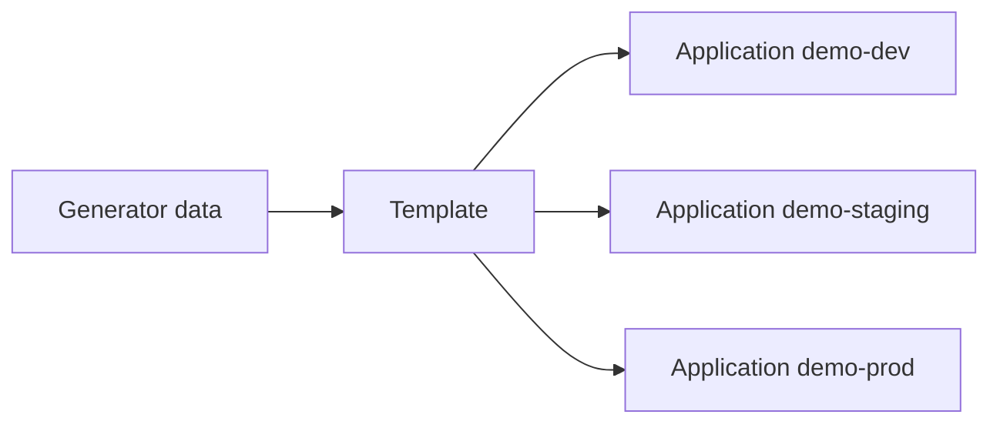

# 06 — AppProject và ApplicationSet

Hai CRD này giải quyết hai bài toán khác nhau:

- AppProject: **app được phép làm gì?**
- ApplicationSet: **làm sao sinh nhiều app nhất quán?**

## 1. Tại sao không dùng project `default` lâu dài?

Project mặc định hữu ích cho thử nghiệm nhưng thường rất rộng. Nếu mọi app đều được lấy từ mọi repo, deploy đến mọi namespace và tạo mọi cluster resource, một commit bị chiếm quyền có blast radius rất lớn.

## 2. Đọc AppProject theo ba chiều

File `labs/argocd/project.yaml`:

```yaml
spec:
  sourceRepos:
    - https://github.com/linhdo04/argocd-learning.git
  destinations:
    - server: https://kubernetes.default.svc
      namespace: demo
    - server: https://kubernetes.default.svc
      namespace: demo-*
  namespaceResourceWhitelist:
    - group: "*"
      kind: "*"
  clusterResourceWhitelist: []
```

### Source

Chỉ repo được tin cậy. URL phải khớp với Application. Có thể dùng deny rule nhưng policy càng rõ càng dễ audit.

### Destination

Giới hạn đồng thời cluster và namespace. Chỉ cho `namespace: demo-*` nhưng `server: '*'` vẫn mở mọi cluster.

### Resource kinds

`clusterResourceWhitelist: []` chặn app tạo CRD, ClusterRole, ClusterRoleBinding, Namespace… Điều này phù hợp lab có `CreateNamespace=true` vì Argo CD tự tạo namespace qua sync option, nhưng production cần kiểm thử policy thực tế và quyền controller.

## 3. Project không thay Kubernetes RBAC

AppProject là guardrail ở Argo CD. Kubernetes API/RBAC/admission policy là lớp enforce cuối. Dùng cả hai:

```text
Git review -> AppProject -> Argo CD RBAC -> Kubernetes RBAC -> Admission policy
```

## 4. ApplicationSet mental model



File `labs/argocd/applicationset.yaml` dùng List generator cho `dev` và `staging`.

```bash
kubectl apply -f labs/argocd/applicationset.yaml
kubectl get applications -n argocd
```

Đừng sửa trực tiếp child Application. ApplicationSet controller sẽ xem template là nguồn đúng và có thể ghi đè thay đổi.

## 5. Generator nào phù hợp?

| Generator | Dùng khi | Rủi ro/chú ý |
|---|---|---|
| List | Danh sách ít và tĩnh | Dễ đọc, lặp khi scale lớn |
| Git directory | Mỗi folder đại diện app/env | Naming/path convention phải chặt |
| Git file | Dữ liệu env nằm trong YAML/JSON | Validate schema dữ liệu |
| Cluster | Deploy theo label của registered clusters | Label sai có thể fan-out lớn |
| Matrix | Kết hợp app × env/cluster | Số app tăng theo tích Descartes |
| Merge | Ghép/override generator theo key | Khó hiểu nếu key không rõ |
| Pull Request | Preview environment | Phải hạn chế code không tin cậy và cleanup |
| SCM Provider | Khám phá nhiều repo | Token và phạm vi discovery cần tối thiểu |

## 6. Go template an toàn hơn

```yaml
goTemplate: true
goTemplateOptions:
  - missingkey=error
```

`missingkey=error` làm generator fail sớm nếu dữ liệu thiếu thay vì sinh tên/path rỗng khó phát hiện.

## 7. Multi-environment không đồng nghĩa copy-paste

Mỗi môi trường nên có:

- destination rõ;
- policy sync phù hợp;
- overlay/values riêng;
- promotion rule;
- quyền phê duyệt tương ứng.

Ví dụ:

| Env | Revision | Sync | Prune | Approval |
|---|---|---|---|---|
| dev | `main` | auto | auto | merge PR |
| staging | release candidate | auto | auto có guardrail | promotion PR |
| prod | SHA/tag đã duyệt | auto hoặc sync window | có kiểm soát | CODEOWNERS/required review |

## 8. Đăng ký cluster ngoài

```bash
kubectl config get-contexts
argocd cluster add TARGET_CONTEXT
argocd cluster list
```

`argocd cluster add` tạo service account/quyền ở cluster đích và lưu thông tin kết nối dạng Secret trong namespace Argo CD. Trước khi chấp nhận mặc định, xem quyền được cấp. Production nên giới hạn namespace/resource theo tenant thay vì cluster-admin rộng.

## 9. App of Apps hay ApplicationSet?

| App of Apps | ApplicationSet |
|---|---|
| Root Application trỏ folder chứa child Application YAML | Controller sinh Application từ generator/template |
| Trực quan khi bootstrap cấu trúc tĩnh | Mạnh khi dữ liệu/env/cluster thay đổi |
| Cascading deletion/finalizer root cần cực kỳ cẩn thận | Template lỗi có thể ảnh hưởng hàng loạt |

Hai pattern có thể cùng tồn tại, nhưng cần một owner rõ cho từng Application.

## 10. Bài tập phá policy có chủ đích

Trên cluster lab:

1. Đổi destination namespace thành `production`.
2. Refresh app.
3. Đọc condition `destination ... not permitted`.
4. Không mở project thành `*`.
5. Đổi lại namespace hợp lệ.

Mục tiêu là biết policy đang bảo vệ bạn, không phải chỉ thấy deployment thành công.

Tiếp theo: [07 — Hooks, waves và database migration](07-hooks-waves-va-database.md).
