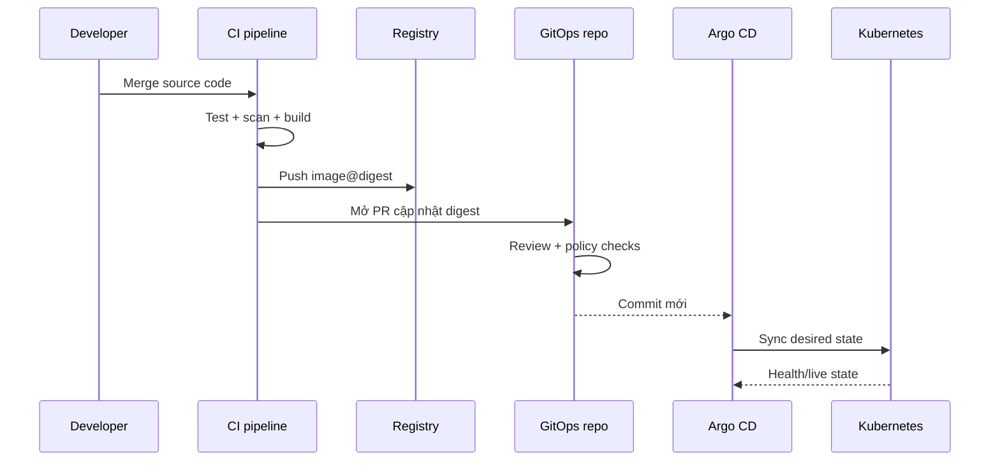

# 08 — Thiết kế CI/CD theo GitOps

Argo CD là phần CD cho Kubernetes, không thay CI.

## 1. Phân trách nhiệm

| Thành phần | Trách nhiệm |
|---|---|
| Source repo CI | lint, test, SAST, build image, scan, sign, push registry |
| Container registry | lưu artifact bất biến và metadata/provenance |
| GitOps repo | desired state theo môi trường |
| Argo CD | render, diff, sync, health, audit revision |
| Admission policy | chặn image/policy không đạt yêu cầu |
| Observability | xác minh release hoạt động thực tế |

## 2. Luồng khuyến nghị



CI không cần gọi `argocd app sync` nếu auto-sync được cấu hình. Pipeline chỉ thay đổi Git; Argo CD làm phần triển khai.

## 3. Build once, promote the same artifact

Sai lầm phổ biến:

```text
build dev -> build staging -> build prod
```

Ba lần build có thể tạo ba artifact khác nhau dù cùng source. Tốt hơn:

```text
build một lần -> image digest A
dev dùng A -> staging dùng A -> prod dùng A
```

Promotion chỉ thay reference trong GitOps repo, không build lại.

## 4. Tag và digest

| Kiểu | Ví dụ | Đặc tính |
|---|---|---|
| Mutable tag | `main`, `latest` | Có thể trỏ artifact khác; khó audit |
| Commit tag | `5bd7351` | Dễ liên hệ source; registry vẫn có thể cho ghi đè nếu không khóa |
| Semantic tag | `1.4.2` | Dễ đọc; cần policy bất biến |
| Digest | `sha256:...` | Xác định đúng bytes, phù hợp promotion chặt |

Production nghiêm túc thường pin digest, có thể giữ tag để người đọc dễ hiểu.

## 5. Ai cập nhật GitOps repo?

### CI mở PR

Ưu:

- rõ source release;
- dễ gắn test result;
- review có chủ đích.

Nhược:

- CI cần credential ghi repo, phải giới hạn scope;
- cần xử lý nhiều release đồng thời.

### Image updater/bot

Ưu: tự động phát hiện tag/digest.

Nhược: policy semver/tag phải rõ; tránh bot đổi prod ngoài review.

### Người vận hành mở PR

Ưu: kiểm soát cao.

Nhược: chậm và dễ thao tác thủ công sai nếu thiếu automation.

## 6. Dev và production nên khác nhau ở đâu?

| Quyết định | Dev | Production |
|---|---|---|
| Revision | branch nhanh | protected branch/tag/SHA |
| Sync | auto | auto có guardrail hoặc window/manual approval |
| Prune | có thể auto | xem xét blast radius, thường vẫn auto sau kiểm soát |
| Review | nhẹ | CODEOWNERS + required checks |
| Artifact | commit tag/digest | cùng digest đã qua staging |
| Rollback | revert | revert + compatibility/data plan |

Manual click trong Argo CD không thay thế review. Nếu desired state xấu đã merge, manual sync chỉ trì hoãn việc apply.

## 7. CI validation cho GitOps repo

Ít nhất nên có:

- parse YAML;
- render Kustomize/Helm;
- schema validation theo Kubernetes version;
- policy checks: privileged, public exposure, resource limits, mutable tags;
- secret scanning;
- diff/render summary cho reviewer.

Repo này có `scripts/validate.sh` cho kiểm tra local cơ bản. Production có thể thêm kubeconform, Conftest/OPA, Trivy config và policy engine phù hợp.

## 8. Webhook

Git provider có thể gọi:

```text
https://argocd.example.com/api/webhook
```

Webhook yêu cầu Argo CD refresh sớm; nó không thay polling và không tự quyết định sync policy. Dùng TLS, webhook secret và hạn chế exposure.

## 9. Progressive delivery

Argo CD đưa desired state vào cluster. Argo Rollouts bổ sung:

- canary/blue-green;
- traffic shifting;
- metric analysis;
- promotion/abort.

Argo CD không tự trở thành công cụ canary chỉ vì Deployment dùng rolling update.

## 10. Chống hai owner

Không để các actor sau cùng apply một Deployment:

- CI chạy `kubectl apply`;
- Helm CLI chạy `helm upgrade`;
- Argo CD auto-sync;
- operator riêng sửa cùng fields.

Mỗi resource cần một owner declarative rõ. Bật `FailOnSharedResource=true` giúp phát hiện hai Application Argo CD cùng claim resource, nhưng không phát hiện mọi external actor.

## 11. Ví dụ promotion

Kustomize overlay prod:

```yaml
images:
  - name: ghcr.io/example/backend
    newName: ghcr.io/example/backend
    digest: sha256:0123456789abcdef...
```

Bot mở PR chỉ thay digest. Reviewer thấy chính xác artifact nào sẽ chạy; sau merge Argo CD sync.

## 12. Câu hỏi thiết kế cần trả lời

- Ai được merge GitOps production?
- CI credential có thể sửa file/path nào?
- Làm sao chứng minh digest đã qua test ở staging?
- Nếu Git provider down, workload hiện tại có tiếp tục chạy không?
- Nếu registry down, rollout mới sẽ thế nào?
- Nếu commit xấu đã sync, RTO và đường revert là gì?
- Database migration có tương thích rollback không?

Tiếp theo: [09 — Ingress và TLS trên K3s](09-ingress-tls-k3s.md).
