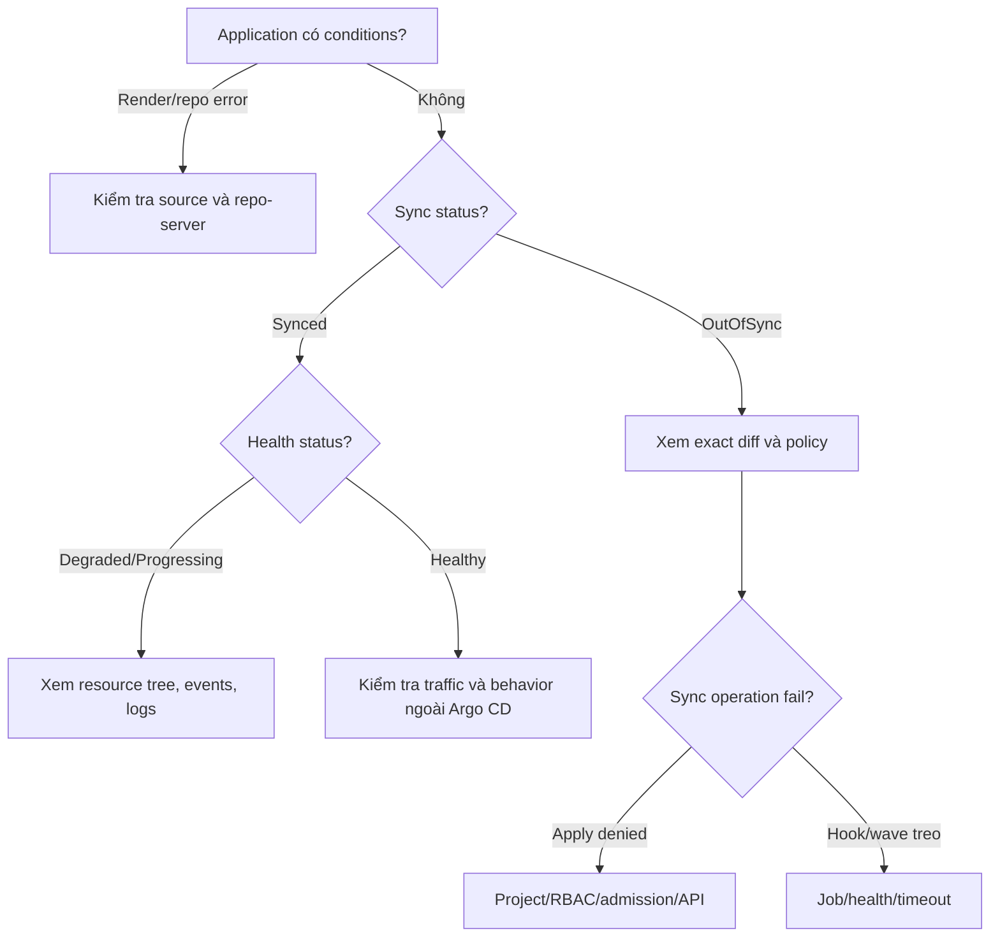

# 11 — Troubleshooting Argo CD có hệ thống

Đừng bắt đầu bằng restart mọi Pod. Trước tiên xác định lỗi ở lớp nào.

## 1. Cây quyết định



## 2. Quy trình 8 bước

### Bước 1 — Xác nhận đúng đối tượng

```bash
kubectl config current-context
argocd app get APP_NAME
```

Ghi lại project, destination cluster/namespace và revision.

### Bước 2 — Đọc Conditions

Conditions thường chỉ ra lỗi repo, render, spec hoặc destination trước cả sync.

```bash
kubectl describe application APP_NAME -n argocd
```

### Bước 3 — Xem manifest đã render

```bash
argocd app manifests APP_NAME
```

Nếu không render được, sửa source/tool/credential; bấm sync lại không giúp.

### Bước 4 — Xem exact diff

```bash
argocd app diff APP_NAME
```

Xác định field, owner và hướng thay đổi. Không ignore cả resource vì một annotation động.

### Bước 5 — Xem operation

```bash
argocd app get APP_NAME --show-operation
```

Tìm resource đầu tiên fail, phase/wave, message từ Kubernetes API.

### Bước 6 — Điều tra resource Kubernetes

```bash
kubectl describe RESOURCE NAME -n NAMESPACE
kubectl get events -n NAMESPACE --sort-by=.lastTimestamp
kubectl logs -n NAMESPACE POD_NAME --all-containers --previous
```

`--previous` hữu ích cho container đã crash/restart.

### Bước 7 — Xem component log đúng

```bash
kubectl logs -n argocd deploy/argocd-repo-server --since=10m
kubectl logs -n argocd statefulset/argocd-application-controller --since=10m
kubectl logs -n argocd deploy/argocd-server --since=10m
kubectl logs -n argocd deploy/argocd-applicationset-controller --since=10m
```

Tên workload có thể khác theo cách cài. Xác nhận bằng:

```bash
kubectl get deploy,statefulset -n argocd
```

### Bước 8 — Hard refresh sau khi có lý do

```bash
argocd app get APP_NAME --hard-refresh
```

Hard refresh loại trừ cache; không sửa manifest sai, quyền sai hay Pod crash.

## 3. Bảng triệu chứng

| Triệu chứng | Lớp thường lỗi | Kiểm tra đầu tiên |
|---|---|---|
| `ComparisonError` | Git/render | Conditions, repo-server logs, path/revision |
| `repository not permitted` | AppProject | `sourceRepos` và URL thực tế |
| `destination ... not permitted` | AppProject | server/name + namespace |
| `resource ... not permitted` | AppProject | resource whitelist/blacklist |
| `PermissionDenied` trên UI/sync | Argo CD RBAC | user/groups, `policy.csv` |
| Kubernetes `Forbidden` | K8s RBAC | controller/cluster credential permissions |
| Admission denied | Policy/webhook | operation message + admission logs |
| `OutOfSync` lặp lại | Field owner/defaulting | exact diff + managedFields |
| `Synced/Degraded` | Workload runtime | resource đỏ, events, logs |
| `Progressing` mãi | Readiness/Job/wave | health, probe, Job timeout |
| `SharedResourceWarning` | Ownership | tìm Application thứ hai |
| AppSet không sinh app | Generator/template | AppSet status/controller logs |
| Deletion treo | Finalizer/permission | resource còn lại và controller permission |

## 4. Repo private lỗi authentication

Trong UI:

```text
Settings -> Repositories
```

Kiểm tra connection status. Với HTTPS token, username thường phải là một chuỗi không rỗng. Với SSH:

- private key đúng format;
- public key đã thêm vào repo;
- host key trong known_hosts;
- URL dùng `git@host:org/repo.git` hoặc `ssh://` đúng.

Không tắt TLS/SSH verification làm giải pháp lâu dài.

## 5. OutOfSync liên tục

Quy trình:

1. Xem field diff.
2. `kubectl get ... -o yaml` và `managedFields`.
3. Xác định controller/webhook sở hữu field.
4. Làm desired state deterministic nếu có thể.
5. Chỉ sau đó cấu hình `ignoreDifferences` hẹp.

Ví dụ HPA và Argo CD cùng quản lý replicas là xung đột owner. Hãy để một bên chịu trách nhiệm.

## 6. Sync treo vì hook/wave

```bash
kubectl get jobs,pods -n APP_NAMESPACE
kubectl describe job JOB_NAME -n APP_NAMESPACE
kubectl logs job/JOB_NAME -n APP_NAMESPACE
```

Kiểm tra:

- Job có kết thúc không;
- `activeDeadlineSeconds`;
- `backoffLimit`;
- dependency/network/DB;
- wave thấp hơn có resource unhealthy;
- hook delete policy có xóa evidence quá sớm không.

## 7. Xóa Application bị treo

Finalizer `resources-finalizer.argocd.argoproj.io` yêu cầu Argo CD xóa managed resources trước khi Application biến mất.

Đừng xóa finalizer ngay. Trước tiên:

- cluster đích còn truy cập được không;
- controller có quyền delete không;
- resource nào bị admission/finalizer khác chặn;
- bạn muốn cascade delete hay orphan workload.

Gỡ finalizer bằng tay có thể orphan resource và mất tracking; chỉ làm theo runbook có chủ đích.

## 8. Emergency stop

Khi auto-sync đang khuếch đại lỗi:

1. xác định app có do ApplicationSet quản lý không;
2. tắt automated sync tại source/template đúng;
3. dừng operation nếu cần:

```bash
argocd app terminate-op APP_NAME
```

4. revert commit xấu;
5. xác minh rendered diff;
6. sync/re-enable có kiểm soát;
7. lưu timeline/audit/postmortem.

Không để emergency live patch trở thành trạng thái vĩnh viễn ngoài Git.

## 9. Mẫu ghi sự cố

```text
Thời điểm:
Ứng dụng / project / cluster / namespace:
Revision desired:
Sync status / health status:
Condition đầu tiên:
Resource đầu tiên fail:
Kubernetes event/error:
Thay đổi gần nhất:
Hành động giảm thiểu:
Kết quả:
Follow-up:
```

Tiếp theo: [12 — Cheat sheet và thuật ngữ](12-cheatsheet-va-thuat-ngu.md).
